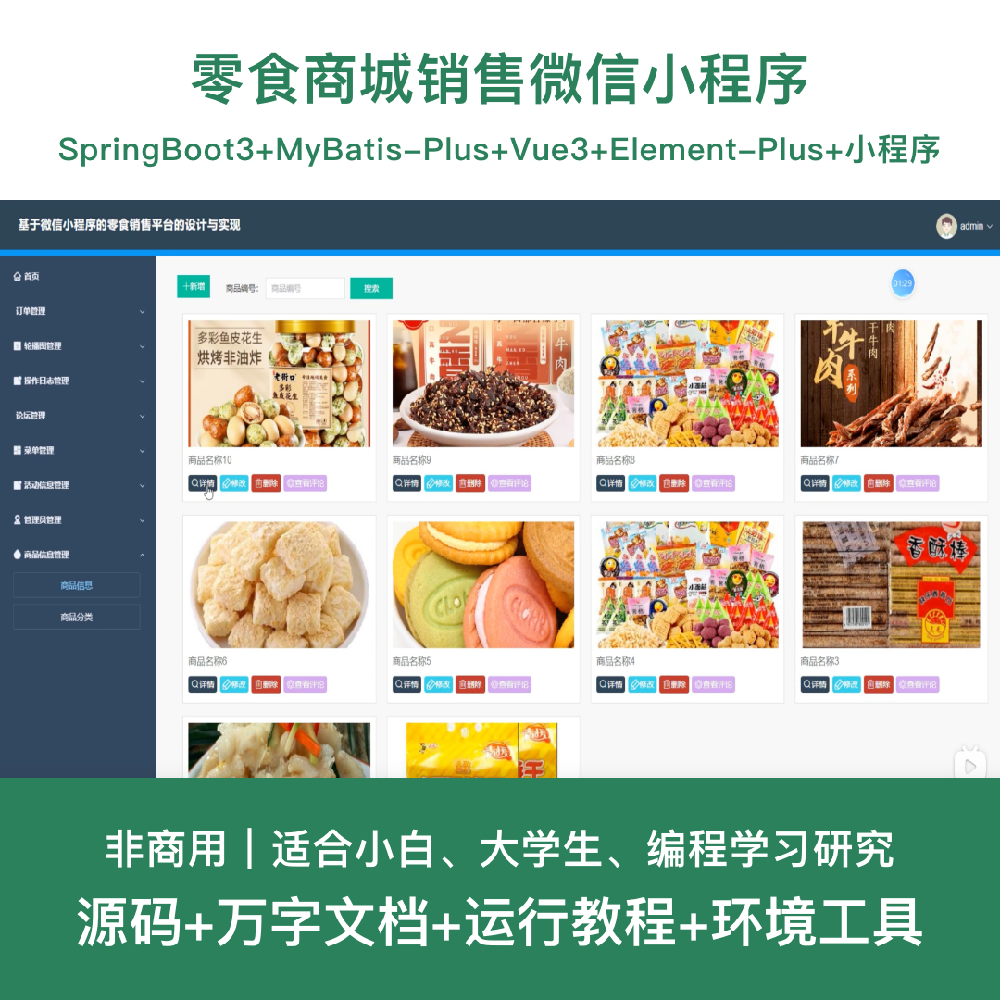
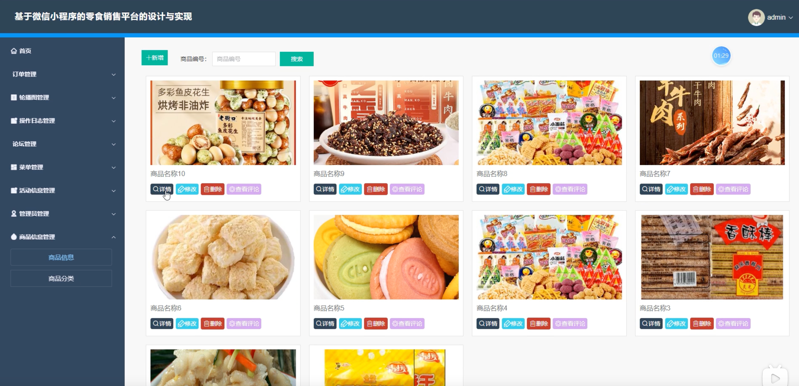
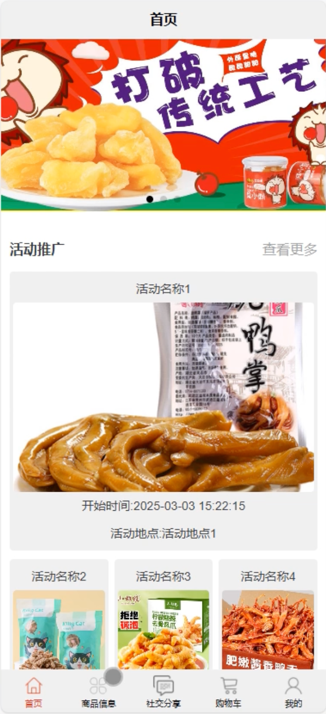
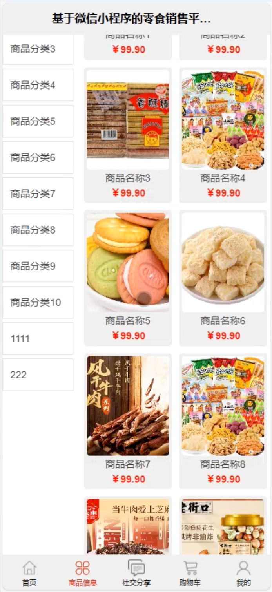
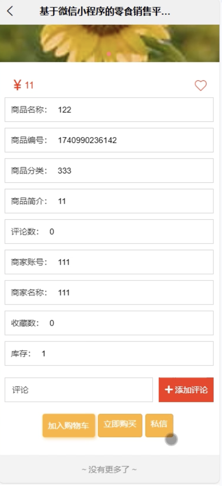
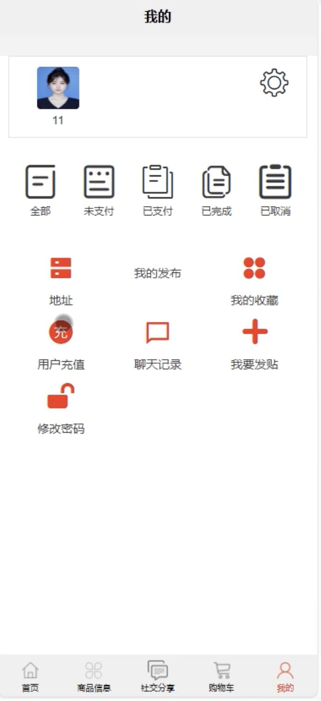
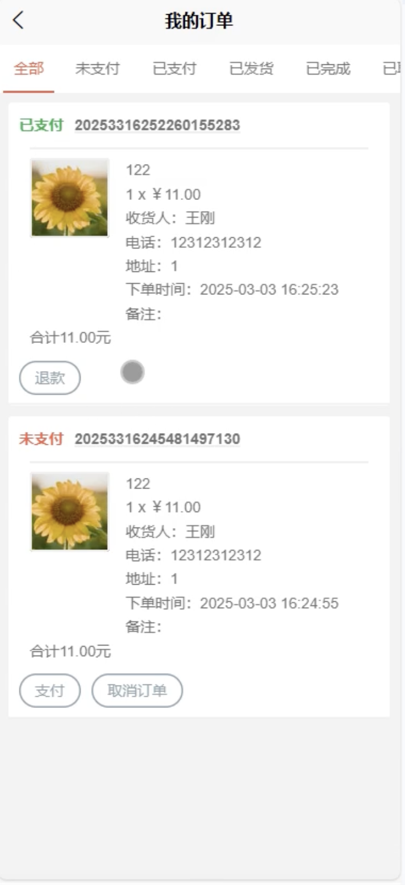
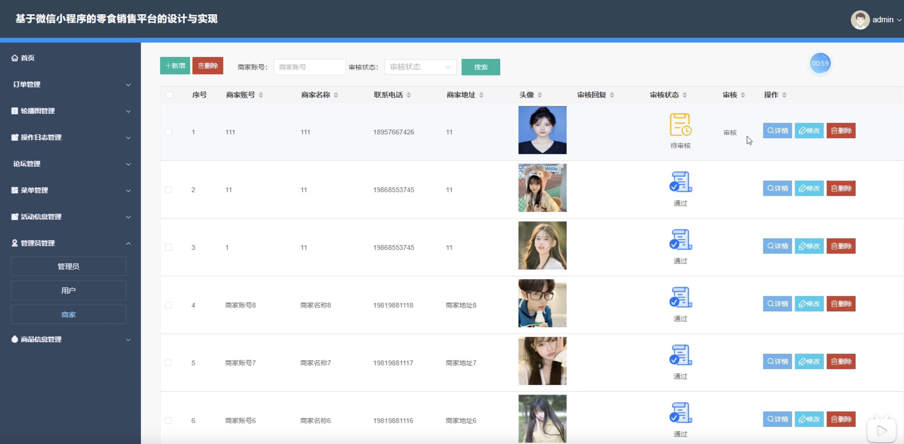
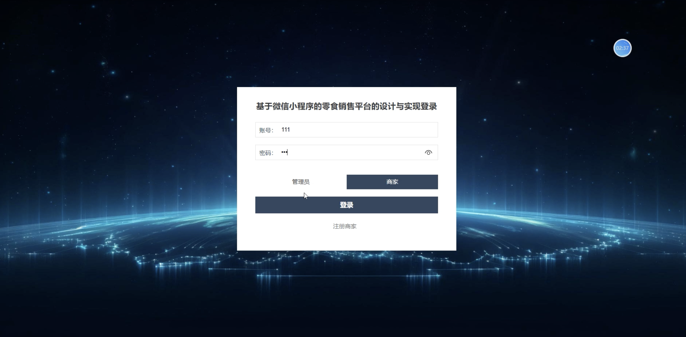

# mpweixinA234D
mpweixinA234D零食商城销售微信小程序+LW
 
## 源码问题查看主页咨询

### 一、关键词
零食商城系统、零食销售系统、小吃商城系统、休闲食品系统、食品销售平台

### 二、作品包含
源码+数据库+万字设计文档+全套环境和工具资源+本地部署教程

### 三、项目技术
前端技术：Html、Css、Js、Vue3.2、Element-Plus、原生微信小程序
后端技术：Java、SpringBoot3.3.0、MyBatis-Plus

### 四、运行环境（以下版本亲测，其他版本兼容性请自行测试）
开发工具：IDEA/eclipse + 微信开发者工具 + VSCODE

数据库：MySQL 8.0+

数据库管理工具：Navicat10以上版本

环境配置软件：JDK17 + Maven3.6+

前端Nodejs：16+

浏览器：谷歌浏览器

### 五、项目介绍
项目编号：mpweixinA234D

基于微信小程序的零食商城销售系统，方便用户随时随地浏览选购各类零食商品，提升商家运营管理效率。

角色：管理员、用户、商家

用户功能：注册登录、商品浏览、搜索查询、加入购物车、在线下单、订单管理、收藏商品、评价晒单、个人中心。

商家功能：登录、商品管理、订单管理、活动促销、库存管理、店铺设置。

管理员功能：登录、用户管理、商家管理、商品信息管理、订单管理、分类管理、活动促销管理、系统日志。

数据库表：18张

### 六、运行截图

